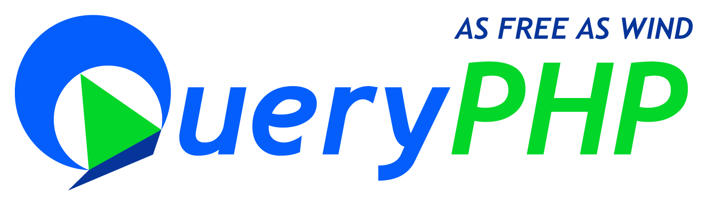

# The QueryPHP Framework

QueryPHP is a powerful PHP framework for code poem as free as wind. [Query Yet Simple]

QueryPHP was founded in 2010 and released the first version on 2010.10.03.

## Official Documentation

Documentation for the framework can be found on the [QueryPHP website](http://www.queryphp.com).

## License

The QueryPHP framework is open-sourced software licensed under the [MIT license](http://opensource.org/licenses/MIT).

## Run tests

```
composer install
```

Just all files.

```
vendor/bin/phpunit Tests
```

Just one dir files.

```
vendor/bin/phpunit Tests/Router
```

Just one file.

```
vendor/bin/phpunit Tests/Option/OptionTest.php
```